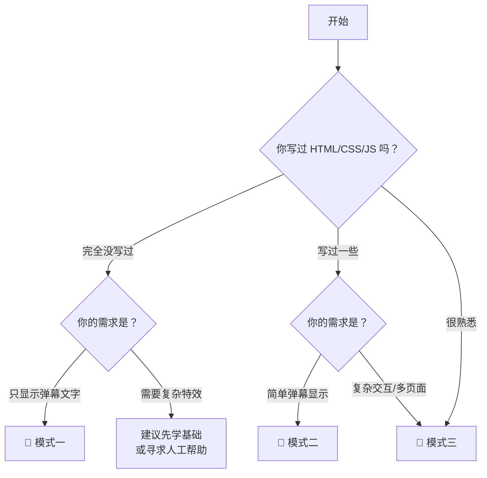

# AI Agent 开发指南

本页面为 **AI 编程助手** 和开发者提供了一套系统化的点心应用开发流程。

如果你是人类开发者，可以直接阅读下方的模式对比选择适合自己的方式。

如果你是 AI Agent，请先阅读 [知识库入口](/llm/index.txt)，再根据决策树帮助开发者。

---

## 选择你的开发模式

点心应用开发提供三种模式，从简单到完整，适应不同技术水平的开发者：

| 特性 | 🥟 模式一：单 HTML | 🍡 模式二：HTML+JS+CSS | 🍰 模式三：Vue3 模板 |
|------|-------------------|----------------------|---------------------|
| **适合人群** | 零前端基础 | 有前端基础 | 前端工程师 |
| **需要 Node.js** | ❌ 不需要 | ❌ 不需要 | ✅ 需要 |
| **代码分离** | 单文件混合 | HTML/CSS/JS 分离 | 组件化 |
| **热更新** | ❌ | ❌ | ✅ |
| **TypeScript** | ❌ | ❌ | ✅ |
| **一键打包 .ds** | 手动 | 手动 | ✅ 自动 |
| **长期维护** | 较困难 | 一般 | 方便 |
| **学习成本** | 极低 | 低 | 中等 |
| **耗时** | 5-30 分钟 | 30 分钟 - 2 小时 | 1-4 小时 |

---

## 🥟 模式一：单 HTML 模式

> 适合：完全没有前端开发经验，只想快速显示弹幕的开发者。

**你只需要：**
- 一个文本编辑器（记事本即可）
- 复制粘贴代码
- 无需安装任何开发工具

**产物：** 2 个文件 — `index.html` + `guide.dimsum.json`

::: details 我能用模式一做什么？
- 显示弹幕文字（支持表情）
- 显示礼物消息
- 显示点赞、关注、入场
- 基本的样式自定义（修改 CSS 颜色/字体）
- 简单的动画效果
:::

::: warning 模式一的局限
代码混杂在一个 HTML 文件中，随着功能增加会变得难以维护。如果你需要多个页面、复杂动画或长期维护，建议升级到模式二或三。
:::

👉 AI Agent 请阅读：[模式一完整工作流](/llm/mode-single.txt)

---

## 🍡 模式二：HTML+JS+CSS 模式

> 适合：有一定前端基础，能写 HTML/CSS/JavaScript，但不想配置构建工具的开发者。

**你需要：**
- 基本的 HTML/CSS/JavaScript 知识
- 一个代码编辑器（推荐 VS Code）

**产物：** 多个文件 — HTML/CSS/JS 分离，模块化结构

::: details 模式二相比模式一的优势
- 代码分离：HTML 结构、CSS 样式、JS 逻辑各自独立
- 可维护：修改样式不影响逻辑，反之亦然
- 可扩展：可以组织多个 JS 模块
- 支持多页面：通过 URL 参数切换不同视图
:::

👉 AI Agent 请阅读：[模式二完整工作流](/llm/mode-multi.txt)

---

## 🍰 模式三：Vue3 + TypeScript 模板模式

> 适合：熟悉现代前端工具链的开发者，需要长期维护或复杂功能。

**你需要：**
- Node.js >= 18.0
- 熟悉 npm/pnpm、Vue、TypeScript
- 了解 Vite 构建工具

**模板地址：** [dimsum-chat-vue3-ts-template](https://github.com/MiegoLive/dimsum-chat-vue3-ts-template)

::: details 模式三的完整特性
- 🎨 **Vue 3 Composition API** — `<script setup>` 语法，逻辑清晰
- 🔥 **Vite 热更新** — 修改代码即时生效，无需手动刷新
- 📘 **TypeScript 严格模式** — 类型安全，智能提示
- 🎬 **TransitionGroup 动画** — 内置滑入/淡出过渡效果
- 📦 **一键打包** — `pnpm run dimsum:build-pack` 直接输出 .ds 文件
- 🌐 **国际化支持** — 多语言配置文件自动识别
- 🔗 **跨 Widget 通信** — 控制台与显示层分离架构
:::

👉 AI Agent 请阅读：[模式三完整工作流](/llm/mode-template.txt)

---

## 我应该选哪个模式？

跟随以下决策流程：



**简单来说：**
- 零基础 + 简单需求 → 模式一
- 有基础 + 一般需求 → 模式二
- 工程师 + 任意需求 → 模式三

---

## 给 AI Agent 的说明

如果你是一个 AI 编程助手，正在帮助开发者创建一个点心应用，请遵循以下协议：

### 1. 先读规则

访问并完整阅读以下文件（按顺序）：

```
/llm/index.txt          — 知识库索引与阅读顺序
/llm/rules.txt          — 元规则引擎（决策树、检查清单、行为约束）
/llm/shared.txt         — 核心共享知识（SDK API、配置格式、消息类型）
/llm/parser-types.txt   — Parser 完整类型声明（⚠️ 禁止猜测任何属性名！）
```

### 2. 执行决策树

不要直接给代码。按照 `rules.txt` 中的决策树，通过对话帮助开发者确定最适合的模式。

### 3. 按工作流执行

选择模式后，读取对应的模式文件，严格按照其中的工作流逐步执行。每个模式文件中的检查清单项目不可跳过。

### 4. 交付前确认

完成代码后，强制检查 rules.txt 中列出的所有检查点，逐项确认无误后再交付。

---

## 静态知识资源

以下资源文件为纯文本格式，专为 AI Agent 优化（低 token 消耗）：

| 文件 | 说明 |
|------|------|
| [index.txt](/llm/index.txt) | 知识库索引与 AI Agent 阅读指南 |
| [rules.txt](/llm/rules.txt) | 元规则引擎：决策树、强制检查清单、行为约束 |
| [shared.txt](/llm/shared.txt) | 核心共享知识：SDK API、配置格式、消息类型、安全规范 |
| [parser-types.txt](/llm/parser-types.txt) | **Parser 完整类型声明**（权威来源，禁止猜测） |
| [mode-single.txt](/llm/mode-single.txt) | 模式一完整工作流与代码模板 |
| [mode-multi.txt](/llm/mode-multi.txt) | 模式二完整工作流与代码模板 |
| [mode-template.txt](/llm/mode-template.txt) | 模式三完整工作流与开发指南 |

---

## 下一步

- 如果你是开发者，已经选好了模式，可以前往对应章节开始开发
- 如果你还需要了解点心 Chat 的基本概念，请先阅读[什么是 DimSum Chat？](./what-is-dimsum-chat)
- 开发完成后，请务必阅读[打包指南](./pack)学习如何分发你的应用
